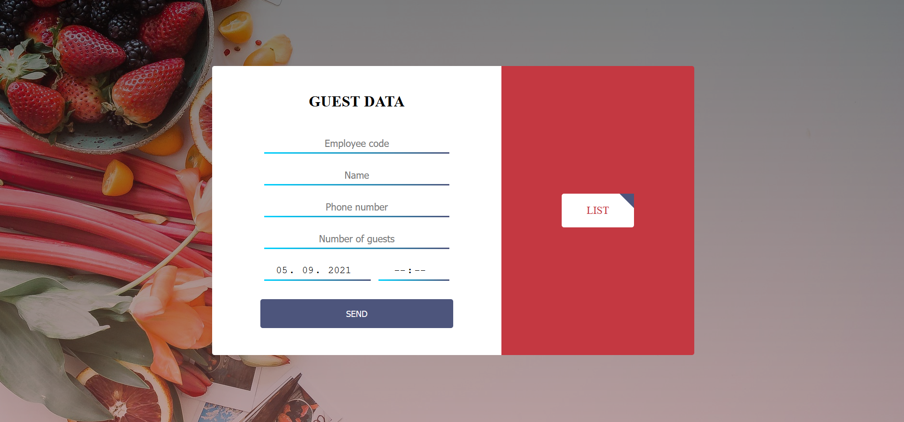

# Guest Data

The employees at the restaurant keep the data about the guests' bookings.

## Browser Compatibility

All of the latest versions of <b>Chrome</b>, <b>Firefox</b>, <b>Edge</b> and <b>Opera</b> browsers are supported.

## Screenshots

### Input fields

The website is made for booking in a restaurant, so I made input fields for enter the guest data which will be managed by employees with their code. 
The data are sent in the database and you can click the button in the right side to see a list of saved data.

### List

First table appears data by months, sum of orders and it will be shown only for last 3 months.
In the table will be saved the data of guests and you can also delete them. I sorted the table by descending a date and a time.

### Search

In case of need to search the data enter a letter, a word or a number and press enter. The item or items will be shown, otherwise the message No record found 
will be appeared. If you want to return back delete the search field and press enter. You can also delete the search item and and then will be shown the rest 
entered data.

[Back to the top](#guest-data)
